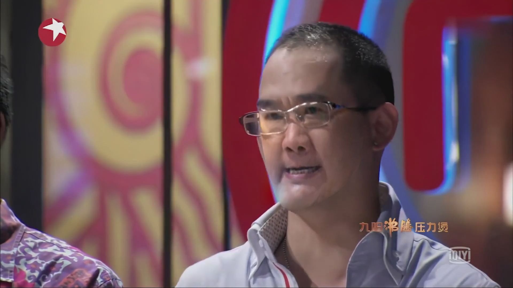
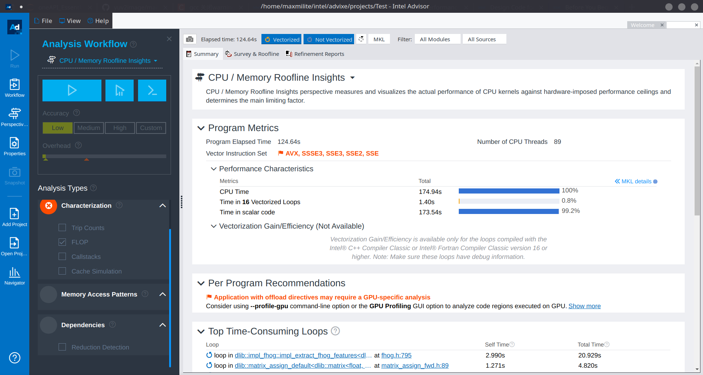

# Face Swap Accelerated by oneAPI

这是山东大学泰山学堂 2022 级大一下学期高级程序设计第三次大作业的开发文档。

本工程利用 Intel oneAPI 的并行加速，利用 Intel oneAPI Video Processing Library 等 Intel oneAPI 工具包，及 OpenCV, dlib 等开源第三方库，实现了一个视频人像换脸的工具。

## 使用方法

> TODO

## 简要运行原理

其使用 oneVPL，对读入的 H.264 视频进行解码，转为 `yuv` 格式的原始图像文件，并转换为 `png` 格式以便进一步处理。

在转码时，使用了 C++ SYCL 进行并行运算处理，加速了 `yuv` 转化为 `png` 中若干个过程（详见 [src/sycl/iamge_processing.h](../src/sycl/image_processing.h))。

此后，dlib 对分解出的图像进行处理。特别的，其中部分函数由于运算过多运行较慢。这里将这些函数所在的头文件进行了抽出并重新编写，融入 C++ SYCL，进行加速处理。

这里使用 Intel Advisor 对整个运行过程中耗时的部分进行了分析，对此表示感谢。

## 并行运算细节

> TODO